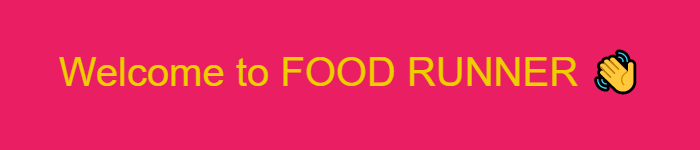
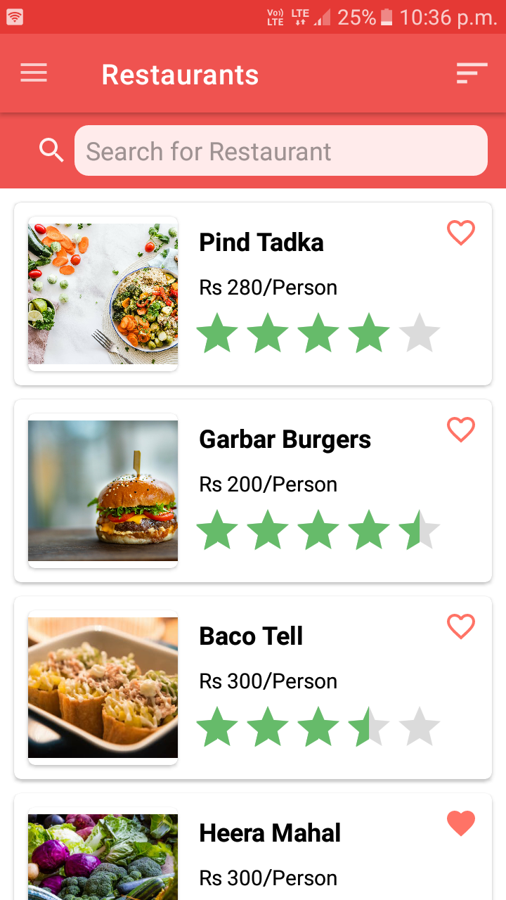

  

  

> This is a Food ordering app which is created for Internshala Android Development Training. Url and token were provided by internshala itself 

## Screenshots

    

  <a href="https://github.com/Sourav-kalal/Food_Runner/tree/main/UI"><b>Please take a look at UI folder for more Screenshots</b></a>

## Author

👤 **SOURAV KALAL**

* Twitter: [@sourav_kalal](https://twitter.com/sourav_kalal)
* Github: [@Sourav-kalal](https://github.com/Sourav-kalal)
* LinkedIn: [@souravkalal](https://linkedin.com/in/souravkalal)
